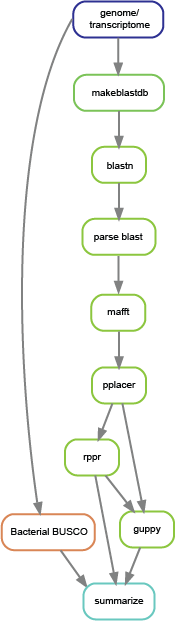

# CSI-SSU

A command-line tool for screening SSU (Small Subunit ribosomal RNA) sequences in genomic and transcriptomic data. This tool helps identify and classify SSU sequences using phylogenetic placement via pplacer.

## Features

- **Automated SSU screening** using BLAST, MAFFT, and pplacer
- **Phylogenetic placement** for accurate taxonomic classification
- **Command-line interface** for easy integration into pipelines
- **Configurable parameters** for different analysis needs

## Installation (from Bioconda)
```
mamba install -c bioconda csi-ssu
```

## Quick Start

### Basic Usage
```bash
# Full pipeline (SSU retrieval + phylogenetic placement) for genome data
csi-ssu <input_assembly> --supergroup <supergroup> --data-type genome

# Full pipeline for transcriptome data
csi-ssu <input_assembly> --supergroup <supergroup> --data-type transcriptome

# Specify output directory and number of threads
csi-ssu <input_assembly> --supergroup <supergroup> --data-type genome -o <out_dir> -t <threads>

# SSU retrieval only (no phylogenetic placement)
csi-ssu <input_assembly> --supergroup <supergroup> --data-type genome --mode retrieval

# Phylogenetic placement only (using pre-extracted SSU sequences)
csi-ssu <ssu_sequences.fasta> --supergroup <supergroup> --mode placement
```

## Command-Line Options

```
positional arguments:
  fasta                      Input FASTA file path (genome/transcriptome or pre-extracted SSU sequences)

required arguments:
  --supergroup SUPERGROUP    Supergroup of interest (Amoebozoa, Excavata, TSAR, Archaeplastida, Cryptista, Haptista, CRuMs, Provora, Obazoa)

optional arguments:
  -h, --help                 show this help message and exit
  --version                  show program's version number and exit
  --data-type DATA_TYPE      {genome, transcriptome} for full or retrieval mode. {pre_collected_ssus} for placement-only mode.
  --mode {full,retrieval,placement}
                             Workflow mode: full (both parts), retrieval (SSU extraction + BUSCO), placement (phylogenetic placement only) (default: full)
  -o, --output-dir           Output directory (default: screening_tool_output)
  --pplacer-cutoff-length    Cutoff length for pplacer (default: 500)
  -t, --threads              Number of threads to use (default: 1)
  --dry-run                  Show what would be run without executing
```

## Input Files

### FASTA File
Standard FASTA format containing sequences to be screened:
- For full run or retrieval mode: genome assembly or transcriptome sequences
- For placement mode: pre-extracted SSU sequences

```
>sequence1
ATCGATCGATCGATCG...
>sequence2
GCTAGCTAGCTAGCTA...
```

## Workflow



## Output

The tool creates a structured output directory with contents depending on the workflow mode:

```
screening_tool_output/
├── logs/              # Log files for each workflow step
├── busco/             # BUSCO contamination screening results (retrieval/full mode)
├── blast_db/          # BLAST database files (retrieval/full mode)
├── blast/             # BLAST search results (retrieval/full mode)
├── parsed_blast/      # Parsed and filtered SSU sequences (retrieval/full mode)
├── mafft/             # Multiple sequence alignments (placement/full mode)
├── pplacer/           # Phylogenetic placement results (placement/full mode)
├── rppr/              # Pplacer database files (placement/full mode)
├── guppy/             # Phylogenetic tree with placements (placement/full mode)
└── summary/           # Final summary reports and visualizations
```

### Main Output Files

**In `summary/` directory:**
- **taxonomy_summary.csv**: Taxonomic classification summary with counts per rank
- **sequence_classifications.csv**: Individual sequence classifications with taxonomic assignments
- **rank_counts.csv**: Detailed counts for each taxonomic rank
- **placement_tree.pdf**: Visualization of phylogenetic tree with sequence placements
- **busco_summary.txt**: Copy of BUSCO contamination screening results (if retrieval was run)

**In `parsed_blast/` directory (retrieval/full mode):**
- **parsed_sequences.fasta**: All extracted SSU sequences
- **parsed_sequences_for_pplacer.fasta**: Filtered SSU sequences meeting length cutoff
- **parsed_results.txt**: Detailed BLAST hit information

**In `pplacer/` directory (placement/full mode):**
- **placement.jplace**: Phylogenetic placement results in JSON format

**In `busco/` directory (retrieval/full mode):**
- **short_summary.specific.bacteria_odb12.busco.txt**: BUSCO contamination assessment

## Examples

### Example 1: Full Pipeline on Genome Data
```bash
csi-ssu genome_assembly.fasta --supergroup Amoebozoa --data-type genome -o results/ -t 8
```

### Example 2: Full Pipeline on Transcriptome Data
```bash
csi-ssu transcriptome.fasta --supergroup Excavata --data-type transcriptome -o ssu_results -t 16
```

### Example 3: SSU Retrieval Only
```bash
csi-ssu genome.fasta --supergroup TSAR --data-type genome --mode retrieval -o retrieval_results/
```

### Example 4: Phylogenetic Placement Only
```bash
csi-ssu ssu_sequences.fasta --supergroup Archaeplastida --mode placement -o placement_results/ -t 4
```

### Example 5: Dry Run (Check What Would Execute)
```bash
csi-ssu genome.fasta --supergroup Obazoa --data-type genome --dry-run
```


### Getting Help

- **GitHub Issues**: [Report bugs or request features](https://github.com/AlexTiceLab/CSI-SSU/issues)
- **Dry run**: Use `--dry-run` to see what commands would be executed


